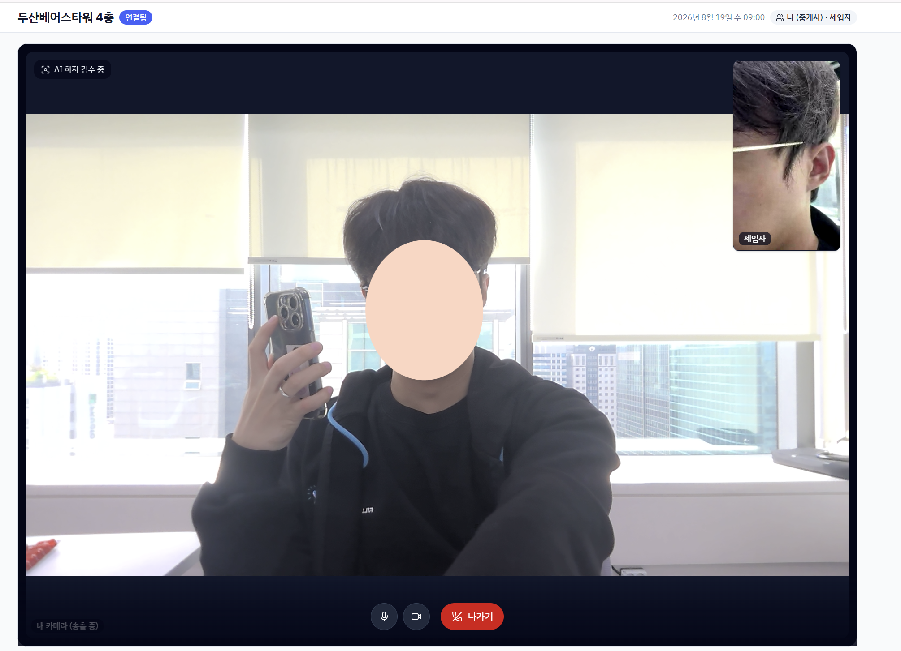

<p align="center">
  
</p>

<h1 align="center">방방봐 (bangbangbwa)</h1>

<p align="center">
  <b>방을 방송으로 봐</b> — 공인중개사와 실시간 화상으로 매물을 확인하고,<br />
  체크리스트와 AI 리포트로 기록을 남기는 비대면 부동산 투어 서비스
</p>

---

## 🛠 사용한 기술

| 구분 | 기술 |
| --- | --- |
| Frontend | React 19, TypeScript, Vite, Tailwind CSS v4, shadcn/ui, TanStack Query 5, Zustand, react-router-dom |
| 실시간 투어 | WebRTC (화상 투어), coturn TURN 서버 |
| Backend | Java 21, Spring Boot (Spring Security · OAuth2 · JPA), PostgreSQL / H2 |
| AI | AI 매물 분석 서버 (RunPod GPU 환경) |
| 인증 · 지도 | 카카오 · 구글 소셜 로그인(OAuth2), Kakao Maps API |
| Infra | AWS EC2 (Ubuntu), Docker · docker compose, Nginx |
| 협업 | GitLab, Jira, Figma |

## 🖥 실행 화면

<p align="center">
  
</p>

| 화면 | 설명 |
| --- | --- |
| 랜딩 (`/`) | 히어로 쇼케이스(매물 카드 → 스크롤 시 투어 영상 재생), 기능 소개, 이용 흐름 타임라인 |
| 매물 목록 (`/properties`) | 검색 · 지역 · 가격 · 유형 필터, 매물 카드 그리드, 저장(찜) 토글 |
| 매물 상세 (`/properties/:id`) | 매물 정보, 저장 · 라이브 투어 예약, 메모 작성 |
| 라이브 투어 | 공인중개사와 WebRTC 실시간 화상으로 매물 확인, 체크리스트 기록 |
| 리포트 | 투어가 끝나면 체크리스트 기반 AI 분석 리포트 제공 |

<!-- 라이브 투어 · 체크리스트 · 리포트 화면의 스크린샷/GIF를 여기에 추가하세요 -->

## 🚀 실행 방법

```bash
# 저장소 클론
git clone https://github.com/dfizae/bangbangbwa.git
cd bangbangbwa

# 의존성 설치
pnpm install

# 개발 서버 실행 (http://localhost:5173)
pnpm dev

# 프로덕션 빌드
pnpm build
```

> 라이브 투어 · AI 리포트 등 전체 기능은 백엔드(Spring Boot) · AI 서버 · TURN 서버가 함께 구동되어야 하며, 이 저장소는 프론트엔드를 담고 있습니다.

## 💡 만든 이유, 목표

- 매물 한 번 보러 **왕복 4시간**
- **사진과 다른 실물**
- 뭘 확인해야 할지 모르는 **첫 계약**

이 세 가지 불편에서 시작했습니다. 방방봐는 **예약 → 라이브 투어 → 체크리스트 → 리포트** 네 단계로 집 보는 방식을 바꾸는 것이 목표입니다.

이 프로젝트를 통해 배운 것들:

- WebRTC 시그널링과 TURN 서버를 이용한 실시간 화상 연결 구조
- OAuth2 소셜 로그인(카카오 · 구글) 연동 흐름
- 디자인 토큰 기반의 일관된 UI 시스템 구축 (Tailwind CSS v4 + shadcn/ui)
- FE · BE · AI · 인프라가 나뉜 팀에서의 협업과 브랜치 전략

## 👤 만든 사람

**김재영** — Frontend

- GitHub: [@dfizae](https://github.com/dfizae)
<!-- - Blog: 블로그 주소를 여기에 추가하세요 -->

## 🙏 감사인사

함께 만든 팀원 5명에게 감사합니다.

| 파트 | 팀원 |
| --- | --- |
| FE | 김재영([@dfizae](https://github.com/dfizae)), 박xx, 황xx |
| BE | 서xx, 윤xx, 최xx |
| AI | 박xx, 최xx |
| 인프라 | 황xx |

도움받은 자료들:

- [shadcn/ui](https://ui.shadcn.com/) — UI 컴포넌트
- [WebRTC samples](https://webrtc.github.io/samples/) — WebRTC 연결 · TURN 동작 테스트
- [Kakao Developers](https://developers.kakao.com/) — 소셜 로그인 · 지도 API
